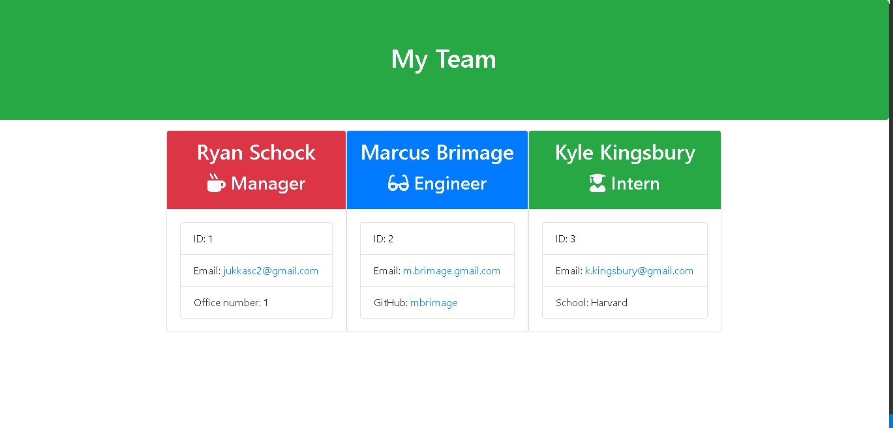

# Template-Engine

A CLI that generates a template for various employee directories. Built using Node, Javascript, HTMl, and Jest

# User Story

As a manager, I would like an application that builds an HTML page of my current team. This will allow me to better manage, and allow team memebers to view the current team.

#Output HTML

#Demo GIF

